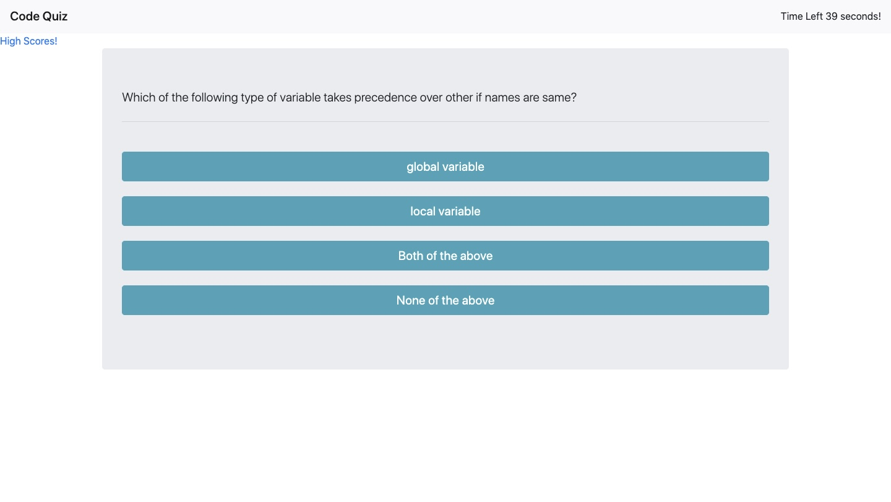

# code-quiz
## Link to the deployed website
 https://mazzeiroman.github.io/code-quiz/

* The user arrives at the home page with a timer set to 1min, and presses the button "Start!" to start the quiz and the countdown on the timer.
* Proceeds to answer all the questions, answering correctly results in a higher score, and answering incorrectly results in a penalty od -10 seconds on the timer.
* when all the questions are answered  the user is presented with a prompt to put their initials and the final score is saved.


## Files and Directories

```
index.html
highscores.html
script.js
script1.js
README.md
>images (the directory contains all the images for the project)
```
## Bootstrap
   * A navbar

   * A responsive layout


## Deployed Site



## Credits

© 2020 Roman Mazzei.